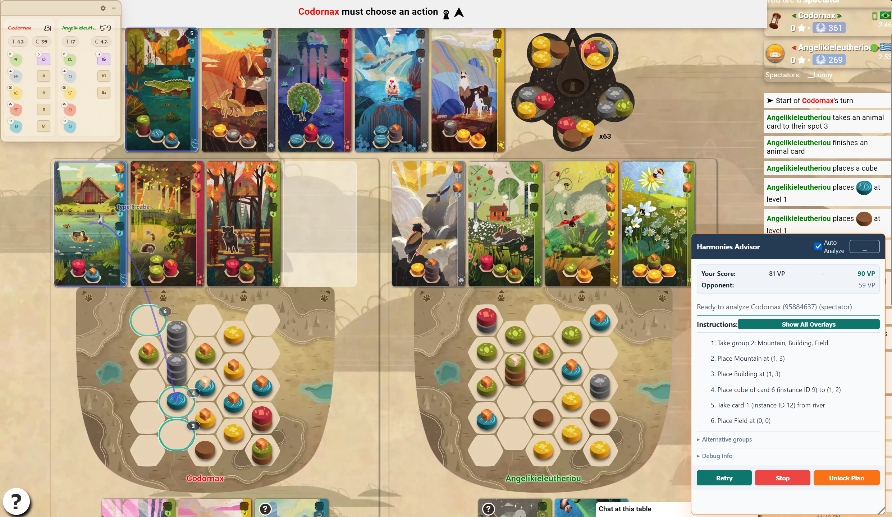

# Harmonies Bot



Harmonies advisor for Board Game Arena (BGA).

It reads the visible/current Harmonies table state, sends a frozen snapshot to a local Rust advisor,
and overlays suggested actions on top of the BGA page. It does **not** click, send BGA actions, or
play the game for you. You still decide what to do and execute moves manually.

This started as a personal project: can I build a Harmonies helper that reads the real BGA page, models the rules faithfully, and produces useful move recommendations fast enough for live games?

Short answer: mostly yes on plumbing and correctness, not yes on "superhuman bot" yet.

## Status

Prototype / research project. Usable for experimenting, not a polished browser-extension product.

What works:

- Firefox content-script overlay.
- Local Rust service over localhost HTTP/WebSocket.
- DOM-first state reading from live/spectated BGA games.
- Current-turn legal move generation, including interleaved token placement, optional card draft,
  Spirit choice, and animal cube settlement.
- Side A and Side B scoring model, with Side A 2p Nature Spirit as main target.
- Score parity checks against real BGA final-score captures.
- Fixture/capture tooling for debugging BGA DOM/gamedatas mismatch.
- Search/heuristic experiments, transposition table, phase-dependent evaluation, tuned weight files.

What does not work enough for my original ambition:

- It does not consistently outperform good human Harmonies players.
- It is not packaged as a self-contained extension. No WASM build path yet.
- The current approach is still a heuristic/tree-search advisor, not a deeply trained strategy engine.
- Future card/token uncertainty is approximated, not solved.
- Macro-strategy is still thin. It can see tactical/near-future value better than long-term plan shape.

So this repo is left as a solid base and a record of the work, not as a finished "destroy everyone"
bot. Painful but fair.

Related child project:

- [miles2542/harmonies-bga-score-display](https://github.com/miles2542/harmonies-bga-score-display) -
  a smaller standalone Firefox extension extracted from this work. It only shows live score, no move advice. A much more practical and useful product for most people, if you play Harmonies on BGA, you should have a look at it!

## Why This Exists

BGA does not expose a detailed live Harmonies score breakdown during a game, and Harmonies has enough
spatial/card interactions that "what should I do this turn?" is not always obvious.

I wanted:

- Accurate rule/scoring simulator.
- Real BGA state parsing, not hand-entered board data.
- A floating panel with the recommended sequence.
- Visual indicators on the actual BGA board/card/group UI.
- Read-only behavior. No action automation.
- Ideally, strong enough suggestions to beat my own play.

The project got a long way through the engineering part. Strategy quality is the unfinished frontier.

## Progress Over Time

This was not built from synthetic toy states only. A big part of the project was making the bot stare
at actual BGA pages and proving it understood them.

Main milestones:

- Gathered BGA `gameui.gamedatas` snapshots from tutorial, real active games, spectated games, and
  post-game screens.
- Built capture and inspector userscripts:
  - `tools/bga_harmonies_capture.user.js`
  - `tools/bga_harmonies_group_inspector.user.js`
- Found that raw `gamedatas` can lag behind the visible board. DOM became the preferred source for:
  central token groups, player boards, visible cards, completed cards, river cards, Spirit choices,
  and cube counts.
- Built the Rust rules/scoring core:
  - token placement legality
  - stack rules
  - hex geometry
  - card pattern matching, rotations, no mirror
  - animal/spirit cube settlement
  - Side A river scoring
  - Side B island scoring
  - trees, mountains, fields, buildings
- Matched scorer output against real BGA final scores. The tracked score-parity corpus covers five
  Side A 2p Nature Spirit final games.
- Built native advisor service and Firefox overlay.
- Added visual overlays:
  - central group highlight
  - step markers on target cells
  - card-to-cell arrows for settlement
  - collapsible/selectable plan tiers
  - live score display in the panel
- Added QA gates:
  - fixture validation
  - advisor plan legality replay
  - extension safety scanner
  - service smoke test
  - benchmark and sweep scripts
- Tried many search/evaluation variants:
  - deeper lookahead
  - root/future beam sweeps
  - transposition table
  - denial heuristics
  - phase-dependent weights
  - Spirit-focused scoring
  - proximity and height-shape penalties
  - SPSA/self-play tournament scripts

Best practical config became "decent and useful", not "dominates strong players". Current conclusion:
more brute-force heuristic tweaking probably has diminishing returns.

## Results / Evidence

Correctness and performance checks that mattered:

- `cargo test`: Rust rules/scoring/search unit tests.
- `python -m tools.score_fixture_corpus`: real BGA final-score parity corpus.
- `python -m tools.validate_advisor_plan_legality`: replays advisor plans for illegal placements,
  illegal drafts, unavailable card settlements, over-settlement, and locked cube cells.
- `python -m tools.service_smoke`: starts service and verifies `/health`, `/advise`, and `/ws`.
- `python -m tools.extension_safety_check`: checks extension remains read-only and localhost-only.

Performance work:

- Cached frontier scoring cut one hard full-hand fixture's root generation from roughly `7.1s` to
  `2.9s`, and first-answer time from roughly `9.2s` to `3.7s`.
- With the later tuned config, the advisor usually returns fast enough for live use on my machine.
- It still does not prove stronger-than-human play.

Strategy work:

- Many weight/search configurations were tried.
- The current best practical mode is Spirit-focused and dynamically demand-tuned.
- Still missing: robust macro strategy, stronger long-term animal-card planning, and better adversarial
  modeling.

## Architecture

```text
BGA page
  -> Firefox content script
  -> DOM + gamedatas visible-state reader
  -> GameSnapshotV1
  -> localhost Rust service
  -> harmonies-core search/scoring
  -> streamed AdvisorResponseV1
  -> overlay panel + board/card indicators
```

Crates:

- `crates/harmonies-core` - model, rules, scoring, search, self-play simulation.
- `crates/harmonies-cli` - local JSON runner, normalize/score/self-play commands.
- `crates/harmonies-service` - localhost HTTP/WebSocket advisor service.

Extension:

- `extension/manifest.json`
- `extension/src/visibleState.js`
- `extension/src/normalizer.js`
- `extension/src/contentScript.js`
- `extension/src/overlay.js`
- `extension/src/advisorClient.js`

Docs/data:

- `docs/Game rules.md`
- `docs/BGA game structure.md`
- `docs/cards_database.json`
- `docs/weights.*.json`
- `fixtures/score_parity`
- `fixtures/advisor_requests`

Tools:

- `tools/bga_harmonies_capture.user.js` - capture current BGA state.
- `tools/bga_harmonies_group_inspector.user.js` - inspect central token group parsing.
- `tools/score_fixture_corpus.py` - scorer parity corpus.
- `tools/validate_advisor_plan_legality.py` - legality replay for advisor outputs.
- `tools/benchmark_cli.py` - benchmark advisor requests.
- `tools/run_tuning_tournament.py` and sweep scripts - search/heuristic experiments.

## Requirements

Tested on Windows 11.

Needed:

- Rust stable toolchain
- Python 3.12+
- Firefox
- `uv` optional, useful for Python tooling
- GitHub CLI only needed if publishing/forking

No Node build step is required for the extension in its current form.

## Running The Advisor

Start the native service:

```powershell
$env:HARMONIES_HEURISTIC_MODE="dynamic_demand_tuned"
$env:HARMONIES_WEIGHTS="docs/weights.spirit_focused.json"
$env:HARMONIES_TT_SIZE="21"
$env:HARMONIES_ROOT_BEAM="2048"
$env:HARMONIES_FUTURE_DEPTH="1"

cargo run --release -p harmonies-service
```

Then load the extension:

1. Open Firefox.
2. Go to `about:debugging#/runtime/this-firefox`.
3. Click `Load Temporary Add-on`.
4. Select `extension/manifest.json`.
5. Open a Harmonies table on BGA.
6. Press `Analyze` in the overlay panel.

The service listens on:

```text
http://127.0.0.1:17848
ws://127.0.0.1:17848
```

## Runtime Configuration

Current recommended config:

```powershell
$env:HARMONIES_HEURISTIC_MODE="dynamic_demand_tuned"
$env:HARMONIES_WEIGHTS="docs/weights.spirit_focused.json"
$env:HARMONIES_TT_SIZE="21"
$env:HARMONIES_ROOT_BEAM="2048"
$env:HARMONIES_FUTURE_DEPTH="1"
cargo run --release -p harmonies-service
```

What those mean:

- `HARMONIES_HEURISTIC_MODE="dynamic_demand_tuned"`  
  Enables the newest hand-tuned heuristic mode. Uses phase/context features beyond raw current score.

- `HARMONIES_WEIGHTS="docs/weights.spirit_focused.json"`  
  Loads current best practical weight profile. More Spirit-aware than baseline.

- `HARMONIES_TT_SIZE="21"`  
  Transposition table size as power of two. `21` means about `2^21` entries. Higher uses more memory.

- `HARMONIES_ROOT_BEAM="2048"`  
  Current-turn root beam. Large because turn ordering/settlement/draft choices matter a lot.

- `HARMONIES_FUTURE_DEPTH="1"`  
  Keeps lookahead shallow. In practice this was more reliable than chasing deeper tactical trees with
  weak macro evaluation.

Other useful environment variables:

- `HARMONIES_SERVICE_HOST` - default `127.0.0.1`.
- `HARMONIES_SERVICE_PORT` - default `17848`.
- `HARMONIES_CATALOG` - default `docs/cards_database.json`.
- `HARMONIES_SEARCH_THREADS` - default logical CPU count minus one.
- `HARMONIES_FUTURE_BEAM` - future-turn beam width.
- `HARMONIES_FUTURE_BRANCH` - future branch width.
- `HARMONIES_REFILL_SAMPLES` - token refill samples.
- `HARMONIES_CARD_REFILL_SAMPLES` - card refill samples.
- `HARMONIES_HARD_STOP_MARGIN_MS` - stop before external budget ends.
- `HARMONIES_MIN_FUTURE_EXPAND_MS` - minimum time needed before expanding another future layer.
- `HARMONIES_SPIRIT_PROX_MULT`, `HARMONIES_SPIRIT_PENALTY_COEFF`,
  `HARMONIES_COMPENSATION_COEFF`, `HARMONIES_FORCE_SPIRIT_LIMIT`,
  `HARMONIES_COMMIT_WEIGHT`, `HARMONIES_CLOG_WEIGHT` - experimental heuristic knobs.

## Development Commands

Core tests:

```powershell
cargo test
```

Service smoke:

```powershell
python -m tools.service_smoke
```

Score parity against tracked real BGA finals:

```powershell
python -m tools.score_fixture_corpus
```

Advisor legality replay:

```powershell
python -m tools.validate_advisor_plan_legality
```

Extension safety check:

```powershell
python -m tools.extension_safety_check
```

Benchmark current fixtures:

```powershell
python -m tools.benchmark_cli --threads 12 --time-budget-ms 30000
```

Run a tuning tournament:

```powershell
python -m tools.run_tuning_tournament
```

Capture a live/spectated BGA state:

1. Install `tools/bga_harmonies_capture.user.js` in ScriptCat/Tampermonkey.
2. Open a Harmonies table.
3. Click `Download`.
4. Use the resulting JSON with converter/validator tools.

## Important Implementation Notes

BGA has two useful state surfaces:

- `window.gameui.gamedatas`
- visible DOM

The visible DOM often wins. During development, `gamedatas` was observed lagging central token groups,
board cells, and sometimes card state. The extension therefore freezes visible state at Analyze time
and uses DOM data where reliable.

Card ids are easy to get wrong:

- DOM `#card_<id>` / `data-card-id` = per-game card instance id.
- `data-card-type-arg` = persistent card catalog id.
- Advisor `cardId` = per-game instance id.
- Advisor `typeArg` = persistent card catalog id.

Settlement is intentionally strict:

- Only active hand cards can be settled.
- River cards can be settled only if drafted earlier in the same plan.
- Opponent cards and completed cards are never valid settlement sources.
- Cube count and locked board cells are enforced.

## Future Work

If someone wants to continue:

- Package the Rust core as WASM so the advisor can be a self-contained extension.
- Try RL + MCTS, policy/value networks, or stronger self-play rather than more hand-tuned heuristics.
- Improve macro strategy:
  - board shape planning
  - card portfolio planning
  - Spirit commitment/abandonment
  - animal-card opportunity cost
  - denial against opponent's visible needs
- Expand fixture corpus with more real BGA captures.
- Add stronger regression tests around live DOM parsing.
- Publish a cleaned extension build only after read-only safety and live parsing are reverified.

I might come back to revenge on this later. For now, this is where it lands.

## Fair Use / Safety

This is a local, read-only research/personal-use tool. It does not automate play and does not send BGA
game actions. Still, using advisors in live online games may violate platform rules or player
expectations. Use responsibly, preferably in private/friends/testing contexts.

This project is not affiliated with Board Game Arena, Libellud, or Harmonies.

## License

Apache-2.0. See [LICENSE](LICENSE).
